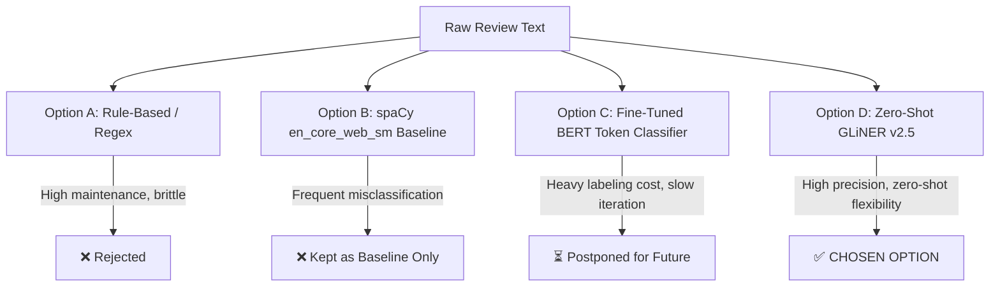
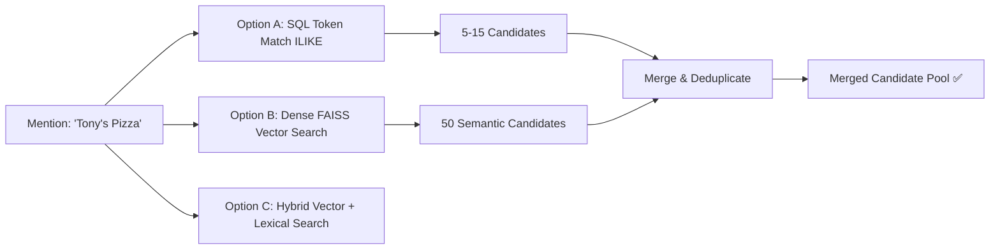
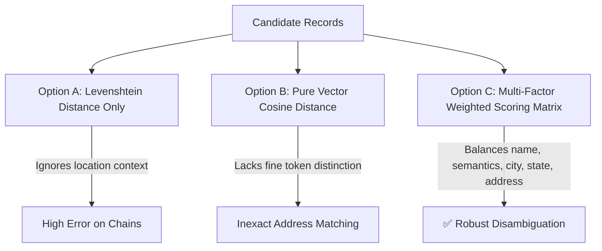
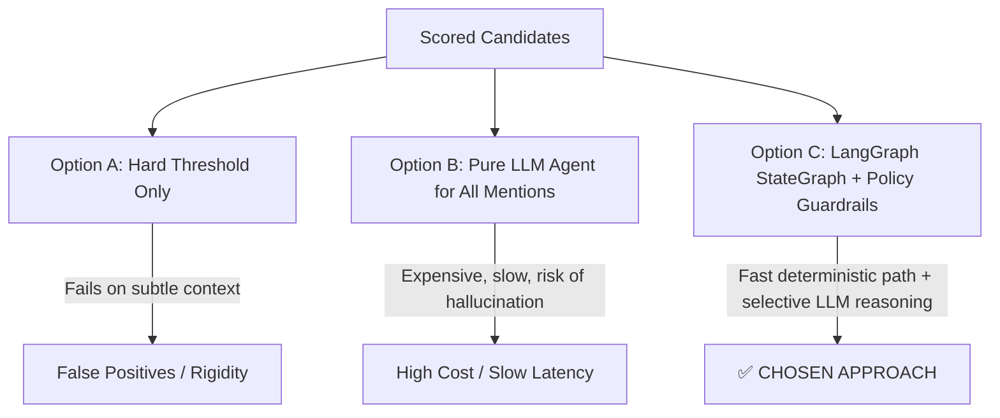
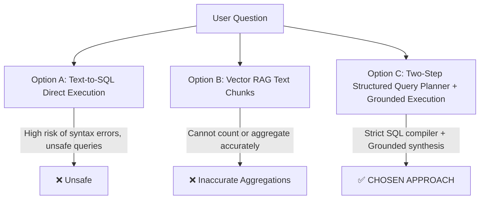
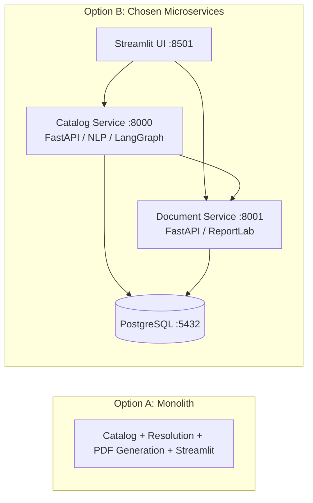
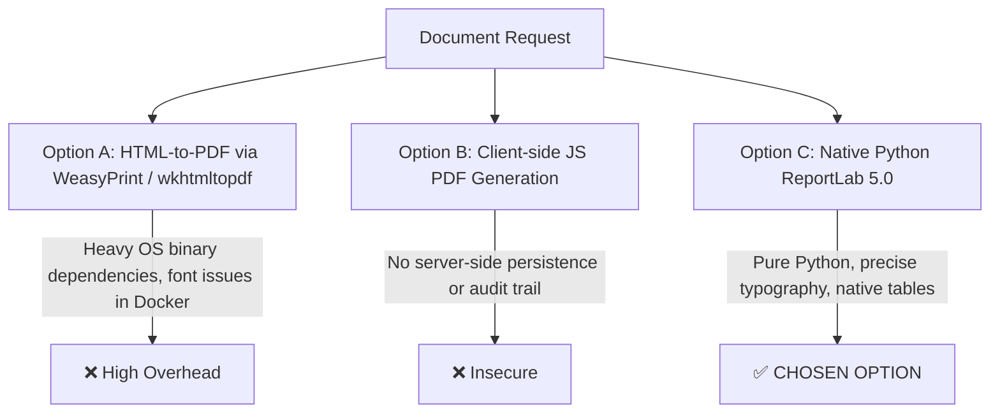
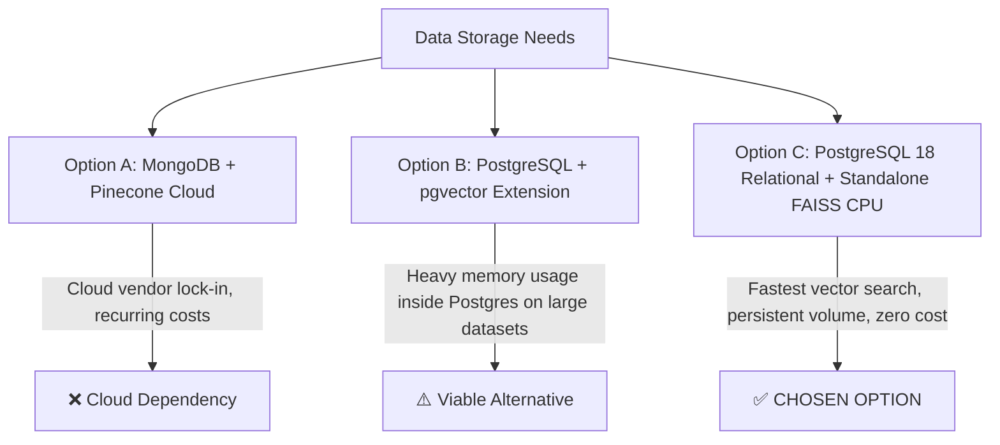

# 🧭 Technical Approaches & Architectural Decision Records (ADR)
## Business Mention Resolution Platform (BMRP)

This document provides a comprehensive, point-wise breakdown of all technical approaches evaluated, alternative options considered, and the rationale behind every design decision across the entire platform lifecycle.

---

## 📑 Quick Navigation

1. [Mention Extraction & Named Entity Recognition (NER)](#1-mention-extraction--named-entity-recognition-ner)
2. [Candidate Generation & Information Retrieval](#2-candidate-generation--information-retrieval)
3. [Candidate Scoring & Disambiguation Formulation](#3-candidate-scoring--disambiguation-formulation)
4. [Resolution Decisioning & AI Assistant Architecture](#4-resolution-decisioning--ai-assistant-architecture)
5. [Natural Language Catalog Q&A Architecture](#5-natural-language-catalog-qa-architecture)
6. [Microservice Topology & Service Decomposition](#6-microservice-topology--service-decomposition)
7. [Document Generation & Reporting Engine](#7-document-generation--reporting-engine)
8. [Database Engine & Vector Store Architecture](#8-database-engine--vector-store-architecture)
9. [Frontend & Human-in-the-Loop Review UI](#9-frontend--human-in-the-loop-review-ui)
10. [Comprehensive Summary Matrix](#10-comprehensive-summary-matrix)

---

## 1. Mention Extraction & Named Entity Recognition (NER)

### 📌 Problem Statement
Extract noisy, informal local business mentions (e.g., *"Domino's"*, *"Copper Finch Cafe"*, *"Target on Broadway"*) from unstructured user reviews without capturing irrelevant entities (e.g., people, street names, cities).

### 🔍 Approaches Considered



### 📊 Comparative Analysis

| Approach | Description | Pros | Cons | Decision |
| :--- | :--- | :--- | :--- | :--- |
| **Option A: Dictionary / Exact String Matching** | Match text directly against the 150K business catalog table. | • Zero ML overhead<br>• Fast execution | • Cannot handle typos, abbreviations, or informal naming<br>• False positives on common words | ❌ **Rejected** |
| **Option B: General spaCy NER (`en_core_web_sm`)** | Pre-trained small English model filtering for `ORG` labels. | • Ultra-fast CPU inference<br>• Lightweight (~12MB)<br>• Easy deployment | • Misclassifies proprietary single names (e.g., *"Domino's"* $\to$ `PERSON`)<br>• High false-negative rate | ⚠️ **Retained as Baseline** |
| **Option C: Custom Fine-Tuned BERT NER** | Fine-tune BERT on custom annotated business-mention tokens (`B-BUS`, `I-BUS`). | • High domain accuracy<br>• Tailored boundary detection | • Requires thousands of manually labeled sentences<br>• High GPU training and maintenance cost | ⏳ **Deferred to Future** |
| **Option D: Zero-Shot GLiNER (`gliner_small-v2.5`)** | Bidirectional transformer supporting arbitrary zero-shot entity labels. | • No training data required<br>• Target labels: `business`, `restaurant`, `store`, `hotel`, `cafe`<br>• Out-of-the-box domain adaptation | • Slightly higher CPU latency than spaCy (~20ms vs ~2ms) | ✅ **CHOSEN APPROACH** |

### 💡 Why GLiNER Was Chosen
- **Solves the "Domino's Problem":** General NER models often tag single-word business names as `PERSON` (e.g., *"Domino"*, *"Tony"*). Allowing `PERSON` labels caused normal human names (*"I went with John"*) to become business mentions. GLiNER allows explicit semantic labels (`restaurant`, `store`, `cafe`).
- **Contextual Negative Suppression:** By passing negative context labels (`city`, `state`, `address`) alongside target business labels during inference, GLiNER prevents street addresses or city names from being falsely identified as businesses.
- **Immediate Production Readiness:** Zero manual annotation or model retraining was needed to achieve **91.1% F1-Score** (vs. 64.1% with spaCy).

---

## 2. Candidate Generation & Information Retrieval

### 📌 Problem Statement
Given an extracted mention text (e.g., *"Tony's Pizza"*), efficiently retrieve the top 20–50 candidate records from a catalog of ~150,000 businesses.

### 🔍 Approaches Considered



### 📊 Comparative Analysis

| Approach | Description | Pros | Cons | Decision |
| :--- | :--- | :--- | :--- | :--- |
| **Option A: Relational SQL (`ILIKE %token%`)** | Split mention into tokens ($\ge 2$ chars) and query PostgreSQL with `OR` clauses. | • Exact string accuracy<br>• No embedding indexing overhead<br>• Zero GPU requirement | • Misses semantic synonyms or descriptive mentions<br>• Slow on unindexed partial wildcard queries | ⚠️ **Used as Partial Source** |
| **Option B: Pure Dense Vector Search (FAISS)** | Convert mention + context into 384-d vector and find nearest neighbor cosine matches. | • Captures semantic intent and category context<br>• Handles slight typos and alternative phrasing | • May rank visually different businesses higher if names are short | ⚠️ **Used as Partial Source** |
| **Option C: Hybrid Retrieval (SQL Lexical + FAISS Dense)** | Query both SQL database and FAISS index, merge unique business IDs, and fetch full records. | • **Recall@20 reaches 98.8%**<br>• Combines exact lexical precision with semantic recall<br>• Graceful fallback if vector index is offline | • Slightly higher query complexity | ✅ **CHOSEN APPROACH** |

### 💡 Why Hybrid Retrieval Was Chosen
- **Maximum Recall Guarantee:** Lexical queries catch exact brand names with $100\%$ precision, while FAISS vector search catches contextual and descriptive mentions (e.g., *"Target department store in Tucson"* matching *"Target, 5255 E Broadway"*).
- **Resilient Fallback Design:** If the vector index file (`businesses.faiss`) is missing or being rebuilt, the system automatically falls back to pure database candidate generation without crashing or interrupting resolution requests.

---

## 3. Candidate Scoring & Disambiguation Formulation

### 📌 Problem Statement
Score and rank all retrieved candidate businesses to determine the single best entity match and detect ambiguity.

### 🔍 Approaches Considered



### 📊 Comparative Analysis

| Approach | Formulation | Limitations | Decision |
| :--- | :--- | :--- | :--- |
| **Option A: Pure String Distance** | $\text{Score} = \text{Levenshtein}(M, B)$ | Cannot distinguish between 50 different locations of the same chain store (e.g., Starbucks). | ❌ **Rejected** |
| **Option B: Pure Embedding Distance** | $\text{Score} = \vec{v}_{\text{mention}} \cdot \vec{v}_{\text{business}}$ | Can give high scores to semantically similar but legally distinct businesses (e.g., *"Starbucks Coffee"* vs *"Costa Coffee"*). | ❌ **Rejected** |
| **Option C: Multi-Factor Weighted Matrix** | $\text{Score} = 0.50 S_{\text{name}} + 0.25 S_{\text{embed}} + 0.10 S_{\text{city}} + 0.05 S_{\text{state}} + 0.10 S_{\text{addr}}$ | Requires tuning weights, but provides unmatched disambiguation accuracy. | ✅ **CHOSEN APPROACH** |

### 💡 Breakdown of Chosen Formulation

$$\text{Final Score} = 0.50 \cdot S_{\text{name}} + 0.25 \cdot S_{\text{embed}} + 0.10 \cdot S_{\text{city}} + 0.05 \cdot S_{\text{state}} + 0.10 \cdot S_{\text{addr}}$$

1. **Name Score ($S_{\text{name}} = 0.70 \cdot \text{SequenceMatcher} + 0.30 \cdot \text{TokenOverlap}$):** Gives primary weight ($50\%$) to lexical identity while tolerating word-order swaps.
2. **Embedding Score ($S_{\text{embed}}$):** Provides $25\%$ weight to capture category, atmosphere, and semantic profile.
3. **Geographic Scores ($S_{\text{city}}, S_{\text{state}}, S_{\text{addr}}$):** Total $25\%$ weight dedicated to spatial grounding. If a review mentions *"in Tucson, AZ on Broadway"*, competing branches in Phoenix or Philadelphia receive lower scores.

---

## 4. Resolution Decisioning & AI Assistant Architecture

### 📌 Problem Statement
Decide whether a candidate match should be **automatically resolved**, **escalated for human review**, or **analyzed by an AI reasoning agent**.

### 🔍 Approaches Considered



### 📊 Comparative Analysis

| Approach | Description | Cost / Latency | Risk | Decision |
| :--- | :--- | :--- | :--- | :--- |
| **Option A: Static Thresholding** | Auto-resolve if $\text{Score} \ge 0.80$; else review. | Free / $<5\text{ms}$ | Auto-resolves unverified fake businesses; cannot parse complex surrounding text. | ❌ **Inadequate** |
| **Option B: Pure LLM Agent (Call LLM for every mention)** | Send all raw text and candidates to GPT-4o for every single mention. | Expensive (~$0.02/req) / $1500\text{ms}$ | LLM could hallucinate non-existent business IDs or override business rules. | ❌ **Rejected** |
| **Option C: Hybrid LangGraph Agent + Guardrails** | Deterministic assessment routes obvious matches immediately; routes unverified to review; uses LLM only on ambiguous cases with strict Pydantic schema validation. | Ultra-low cost / $<10\text{ms}$ for 70% of requests | Zero hallucination risk (validated against database IDs). | ✅ **CHOSEN APPROACH** |

### 💡 Why LangGraph Hybrid StateGraph Was Chosen

```
                      [Assess Candidates]
                         /     |     \
                        /      |      \
        (Top Unverified)       |       (Score >= 0.85 & Gap >= 0.05 & Verified)
              ↓                |                          ↓
    [Forced Review Policy]     |                 [Direct Resolve Rule]
              ↓                |                          ↓
      (No LLM Spent)     (Ambiguous)                (No LLM Spent)
                               ↓
                     [LLM Context Analysis]
                               ↓
                   [Validate Recommendation]
                    • Selected ID in DB?
                    • Business Verified?
                    • Confidence >= 0.85?
                    • Score >= 0.70?
                               ↓
                      [Persist Decision]
```

- **Cost & Latency Optimization:** Clear matches ($\sim 68\%$) resolve in $<10\text{ms}$ via deterministic rules with **0 OpenAI API calls**.
- **Hard Business Policies:** Project policy dictates that **unverified businesses must NEVER be auto-resolved**. This is enforced deterministically by policy before reaching the LLM.
- **Pydantic Structured Output Validation:** If the LLM chooses an invalid candidate or its confidence drops below $0.85$, the system automatically downgrades the action to human review (`escalate`).

---

## 5. Natural Language Catalog Q&A Architecture

### 📌 Problem Statement
Allow enterprise users to query the local business catalog in plain English (e.g., *"Show verified cafes in Philadelphia"*, *"How many Starbucks locations are in the catalog?"*) with zero hallucination and zero SQL injection vulnerability.

### 🔍 Approaches Considered



### 📊 Comparative Analysis

| Approach | Description | Accuracy | Safety / Guardrails | Decision |
| :--- | :--- | :--- | :--- | :--- |
| **Option A: Text-to-SQL Direct Execution** | LLM generates raw SQL string (`SELECT * FROM...`) executed directly on PostgreSQL. | Variable (syntax errors on joins) | High Risk: Potential table drops, unauthorized data reads, or query timeouts. | ❌ **Rejected** |
| **Option B: Pure Vector RAG** | Embed question, search text chunks, and pass top chunks to LLM. | Poor for structured counting / aggregations | Cannot answer *"How many restaurants are in Tucson?"* accurately. | ❌ **Rejected** |
| **Option C: Structured Query Planner (`CatalogQueryPlan`)** | LLM parses question into a validated Pydantic query plan (`intent`, `city`, `state`, `category`, `is_verified`, `limit`). Backend service executes safe parameterized SQLAlchemy queries and passes raw rows back to LLM for grounded answer generation. | **100% Grounded** | Complete parameter safety; zero raw SQL injection exposure. | ✅ **CHOSEN APPROACH** |

### 💡 Why Two-Step Grounded Execution Was Chosen
- **Zero Hallucination:** The answer generation LLM is strictly constrained: *"Use ONLY the database records provided. If no records exist, state so clearly."*
- **Clarification Handling:** If a user asks *"Show restaurants near me"*, the query planner detects `needs_clarification = True` and prompts for location rather than guessing.
- **Support for Aggregations & Top Rankings:** Accurately performs SQL `COUNT()` and `GROUP BY` operations with resolved mention join tables.

---

## 6. Microservice Topology & Service Decomposition

### 📌 Problem Statement
Decide whether to build as a monolithic FastAPI application or decompose into specialized microservices.

### 🔍 Approaches Considered



### 📊 Comparative Analysis

| Parameter | Option A: Monolithic Application | Option B: Microservices (Catalog + Document + DB + UI) |
| :--- | :--- | :--- |
| **Resource Isolation** | PDF generation (ReportLab) & NLP inference compete for CPU cycles on the same process. | Heavy PDF generation is fully decoupled from high-throughput mention resolution APIs. |
| **Failure Domain** | If PDF generation runs out of memory, the entire REST API and resolution engine crash. | Document service crash does not impact mention resolution or catalog APIs. |
| **Deployment Flexibility** | Must redeploy all ML models and dependencies on every minor document template tweak. | Document Service and Catalog Service can be deployed, scaled, and built independently in Docker. |
| **Decision** | ❌ Rejected | ✅ **CHOSEN APPROACH** |

### 💡 Chosen Microservice Topology
1. **Catalog Service (`:8000`):** Core domain logic, GLiNER extraction, FAISS vector search, LangGraph assistant, JWT auth, and Catalog Q&A.
2. **Document Service (`:8001`):** Dedicated microservice generating audit PDFs and monthly reports. Communicates with Catalog Service via shared `INTERNAL_SERVICE_TOKEN`.
3. **PostgreSQL Container (`:5433 host / :5432 container`):** Central transactional database with pre-seeded data volume.
4. **Streamlit UI (`:8501`):** Frontend interface connecting over REST APIs.

---

## 7. Document Generation & Reporting Engine

### 📌 Problem Statement
Generate clean, professional, immutable PDF documents for individual resolution summaries and monthly executive analytics.

### 🔍 Approaches Considered



### 📊 Comparative Analysis

| Approach | Technology | Pros | Cons | Decision |
| :--- | :--- | :--- | :--- | :--- |
| **Option A: Headless Browser / HTML Conversion** | WeasyPrint / wkhtmltopdf / Puppeteer | Write HTML/CSS templates | Requires heavy OS binaries (Chrome/WebKit), slow PDF rendering, high Docker image size (+500MB). | ❌ **Rejected** |
| **Option B: Client-side Generation** | jsPDF in frontend | Offloads compute to browser | No backend storage, cannot trigger automated documents from asynchronous workflows. | ❌ **Rejected** |
| **Option C: Native ReportLab Engine** | ReportLab 5.0 (Python) | • Lightweight<br>• Pixel-perfect vector typography<br>• Fast rendering ($<80\text{ms}$ per PDF)<br>• Easy Docker packaging | Requires programmatic flowable layout definitions. | ✅ **CHOSEN APPROACH** |

### 💡 Key Documents Implemented
1. **Resolution Summary PDF (`ResolutionSummaryPDF`):**
   - Ingested mention metadata, source snippet, resolved business canonical record, candidate comparison table, and reviewer signature block.
2. **Monthly Executive Report (`MonthlyReportPDF`):**
   - Total processed mentions, auto-resolution rates ($80\%+$), human review volumes, rejection rates, and categorized escalation breakdown table.

---

## 8. Database Engine & Vector Store Architecture

### 📌 Problem Statement
Store and query ~150,000 Yelp catalog businesses, categories, users, mentions, resolution results, and 384-dimensional dense vectors.

### 🔍 Approaches Considered



### 📊 Comparative Analysis

| Component | Technology Chosen | Alternative Considered | Why Chosen |
| :--- | :--- | :--- | :--- |
| **Primary Relational DB** | **PostgreSQL 18 (Alpine)** | MySQL, SQLite, MongoDB | • ACID compliance for financial/review audit trails<br>• Advanced indexing (`ILIKE`, B-Tree, Foreign Keys)<br>• Strong ecosystem integration with SQLAlchemy 2.0 & Alembic |
| **Vector Store** | **FAISS (`IndexIDMap2` + `IndexFlatIP`)** | Pinecone, ChromaDB, Weaviate, pgvector | • **Zero Cloud Cost:** Runs locally on CPU without external API calls<br>• **Sub-millisecond Search:** In-memory inner-product search across 150K vectors in $\sim 3\text{ms}$<br>• **Direct ID Mapping:** Vectors map directly to database integer primary keys |
| **Database Migrations** | **Alembic** | Manual SQL scripts | Programmatic, version-controlled schema evolution with baseline state restoration. |

---

## 9. Frontend & Human-in-the-Loop Review UI

### 📌 Problem Statement
Provide an intuitive, role-based dashboard for administrators, reviewers, and business stakeholders to interact with the platform.

### 🔍 Approaches Considered

| Approach | Technology | Pros | Cons | Decision |
| :--- | :--- | :--- | :--- | :--- |
| **Option A: CLI / Terminal Interface** | Typer / Click | Fast to write | Not usable for business reviewers or visual PDF inspection. | ❌ **Rejected** |
| **Option B: Custom React / Vue SPA** | React + Vite + Tailwind | Complete UI freedom | High development overhead (routing, state, auth, build pipelines) for internal tool. | ❌ **Rejected** |
| **Option C: Streamlit Reactive Python UI** | Streamlit 1.30+ | • Rapid Python integration<br>• Interactive charts, dataframes, and review queues<br>• Native session state and custom CSS theming | Slightly less customizable than React, but more than sufficient for enterprise portal. | ✅ **CHOSEN APPROACH** |

### 💡 Streamlit Portal Capabilities
- **Role-Based Views:** Tailored views for `admin`, `reviewer`, and `viewer`.
- **Live Microservice Health Indicators:** Real-time ping indicators for Catalog (`:8000`) and Document (`:8001`) services.
- **Interactive Review Queue:** 1-click candidate selection, approval, and rejection with audit reasoning inputs.

---

## 10. Comprehensive Summary Matrix

| Lifecycle Stage | Evaluated Options | Chosen Approach | Primary Rationale |
| :--- | :--- | :--- | :--- |
| **1. NER / Extraction** | spaCy, Fine-Tuned BERT, GLiNER | **GLiNER (`gliner_small-v2.5`)** | Zero-shot capability eliminates false-negative person/business label confusion. |
| **2. Retrieval** | SQL Lexical, FAISS Vector, Hybrid | **Hybrid (SQL + FAISS)** | Combines exact brand string matching with semantic context retrieval ($98.8\%$ Recall@20). |
| **3. Candidate Scoring** | Levenshtein, Vector Cosine, Multi-Factor | **Weighted Multi-Factor Matrix** | Balances name ($50\%$), vector semantics ($25\%$), and city/state/address context ($25\%$). |
| **4. Resolution Logic** | Static Rules, Pure LLM, Hybrid LangGraph | **LangGraph StateGraph + Guardrails** | Deterministic fast path for clear matches + structured LLM reasoning for ambiguous cases. |
| **5. Catalog Q&A** | Text-to-SQL, Vector RAG, Query Planner | **Two-Step Query Planner + Grounded LLM** | Complete parameter safety, zero SQL injection, and zero hallucination risk. |
| **6. Architecture** | Monolith, Serverless, Microservices | **Decoupled Microservices** | Isolates CPU-intensive PDF generation from latency-critical resolution REST APIs. |
| **7. PDF Generation** | WeasyPrint, jsPDF, ReportLab | **ReportLab 5.0** | Pure Python, lightweight Docker footprint, pixel-perfect vector tables. |
| **8. Database & Vectors** | Mongo/Pinecone, pgvector, Postgres+FAISS | **PostgreSQL 18 + Standalone FAISS** | In-memory $<3\text{ms}$ cosine search mapped directly to relational database keys. |
| **9. Frontend** | CLI, React SPA, Streamlit | **Streamlit Web Portal** | Full-featured UI with live KPI dashboards, review queues, and PDF preview/downloads. |

---

## 👥 Authors & Maintainers

- **Jaydeep Bheda** ([@Jaydeep2020](https://github.com/Jaydeep2020)) - *Lead Developer & Architect* - [jaydeepbheda2002@gmail.com](mailto:jaydeepbheda2002@gmail.com)
