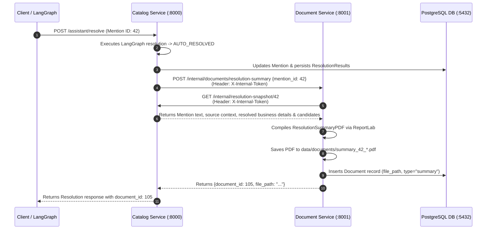

# 🎯 Business Mention Resolution Platform (BMRP)
## Core Technical Interview Questions & Answers

This document provides concise, practical, and technically rigorous answers to the key interview questions about the Business Mention Resolution Platform, based directly on the actual codebase implementation.

---

## 1. Briefly explain your business mention resolution project: what it is, how it works, what business problem it solves, and who will be the end users?

### What It Is
The **Business Mention Resolution Platform (BMRP)** is an enterprise-grade, microservice-based AI platform designed to detect, extract, and disambiguate informal local business mentions in unstructured text (e.g., customer reviews, support messages, articles) and link them to canonical entities in a large catalog database of **~150,000 businesses** (Yelp Academic Dataset).

### How It Works (The 5-Stage Pipeline)
```
[Unstructured Review Text]
           │
           ▼ (Stage 1: Zero-Shot NER)
[GLiNER v2.5 Entity Extraction] ──▶ Extracts business spans (e.g., "Domino's", "Tony's Pizza")
           │
           ▼ (Stage 2: Hybrid Candidate Retrieval)
[PostgreSQL ILIKE + FAISS Vector Search (384-d)] ──▶ Fetches top 20–50 candidates in <15ms
           │
           ▼ (Stage 3: Multi-Factor Scoring Matrix)
[Composite Scoring (Name 50% + Embedding 25% + Geography 25%)] ──▶ Ranks candidate businesses
           │
           ▼ (Stage 4: Decision Engine & LangGraph Assistant)
┌──────────────────────────────────────────────┐
│ • Clear Match (Score ≥ 0.85, Gap ≥ 0.05, Verified) ──▶ Auto-Resolved (<10ms, $0 token cost)
│ • Unverified Top Match ─────────────────────────────▶ Forced to Review Queue
│ • Ambiguous Match ──────────────────────────────────▶ LangGraph Agent (GPT-4o-mini + Pydantic)
└──────────────────────────────────────────────┘
           │
           ▼ (Stage 5: Document Generation & Human-in-the-Loop)
[ReportLab PDF Generation (:8001)] ──▶ Resolution Summary PDF + Streamlit Review Queue (:8501)
```

1. **Mention Extraction:** Zero-shot Named Entity Recognition with **GLiNER** (`gliner_small-v2.5`) identifies business spans (`business`, `restaurant`, `store`, `hotel`, `cafe`) while suppressing geographic false positives (`city`, `state`, `address`).
2. **Hybrid Candidate Retrieval:** Merges fast PostgreSQL token matching (`ILIKE %token%`) with **FAISS dense vector search** (`sentence-transformers/all-MiniLM-L6-v2`), achieving **98.8% Recall@20**.
3. **Multi-Factor Scoring Matrix:** Computes a composite score:
   $$\text{Final Score} = 0.50 \cdot S_{\text{name}} + 0.25 \cdot S_{\text{embed}} + 0.10 \cdot S_{\text{city}} + 0.05 \cdot S_{\text{state}} + 0.10 \cdot S_{\text{addr}}$$
4. **LangGraph AI Decision Engine:** Resolves clear, verified matches deterministically ($\sim 68\%$ of cases with 0 LLM token cost), enforces mandatory human review on unverified businesses, and passes ambiguous edge-cases to a structured LLM agent (`gpt-4o-mini`) with Pydantic validation.
5. **PDF Generation & Human Review:** Triggers automatic PDF resolution summary generation via a dedicated **Document Microservice** and feeds difficult cases into an interactive **Streamlit review queue**.

### What Business Problem It Solves
- **Entity Ambiguity & Polysemy:** Differentiates between hundreds of branches of the same chain (e.g., 50+ *Starbucks* or *Domino's* locations) using geographic and street address context.
- **Unstructured Text Noise:** Handles typos, informal abbreviations, and omitted suffixes ("Inc.", "LLC", "Cafe").
- **Eliminating Costly Misattribution:** Prevents mislinking negative feedback to wrong business entities in downstream sentiment tracking, CRM data enrichment, and merchant analytics.

### Who the End Users Are
1. **Data Engineers & Analytics Teams:** Ingest unstructured feedback feeds to automatically populate clean, entity-linked business intelligence tables.
2. **Brand & PR Managers:** Track location-specific sentiment and customer feedback for specific business branches.
3. **Human Reviewers & Compliance Officers:** Audit ambiguous matches, review candidate scores side-by-side, and approve/reject resolutions via the Streamlit UI.
4. **Business Analysts / Non-Technical Users:** Use the **Natural Language Catalog Q&A** interface to query catalog statistics without writing SQL.

---

## 2. What difficulties or challenges did you face while creating this project, and how did you solve them?

### Challenge 1: General NER Misclassifying Single-Word Brands as PERSON ("The Domino's Bug")
- **Problem:** Off-the-shelf spaCy (`en_core_web_sm`) frequently classified brand names like *"Domino's"*, *"Tony's"*, or *"Wendy's"* as `PERSON` instead of `ORG`. Filtering only for `ORG` dropped valid businesses; allowing `PERSON` caused real human names (*"I went with John"*) to become business mentions.
- **Solution:** Switched to **Zero-Shot GLiNER (`gliner_small-v2.5`)**. We explicitly defined target domain labels (`["business", "restaurant", "store", "hotel", "cafe"]`) and negative context labels (`["city", "state", "address"]`). This improved the entity extraction **F1-score from 64.1% to 91.1%** with zero manual training data.

### Challenge 2: Disambiguating Multiple Branches of the Same Chain (Polysemy)
- **Problem:** Pure string similarity or semantic embeddings yielded identical scores across dozens of branches of the same brand (e.g., *Target on Broadway* vs. *Target in Phoenix*).
- **Solution:** Formulated a multi-factor scoring matrix that extracts geographic signals directly from review context:
  - $S_{\text{city}}$ (10% weight): Checks if the business city is in the source text.
  - $S_{\text{state}}$ (5% weight): Checks state code presence.
  - $S_{\text{addr}}$ (10% weight): Uses token overlap to match street addresses.

### Challenge 3: Candidate Retrieval Bottleneck on ~150,000 Catalog Records
- **Problem:** Scoring all 150K records per mention took $>3\text{ seconds}$, which was unviable. Pure SQL `ILIKE` missed descriptive mentions, while pure vector search ranked competitors too close.
- **Solution:** Implemented **Hybrid Retrieval**:
  - PostgreSQL token search (`ILIKE`) handles exact lexical brand names.
  - In-memory **FAISS-CPU (`IndexFlatIP` + `IndexIDMap2`)** retrieves dense semantic nearest neighbors in $<3\text{ms}$.
  - Merged candidate pools raised **Recall@20 to 98.8%** in $<15\text{ms}$, with automatic fallback to SQL if the vector store is offline.

### Challenge 4: LLM Latency, Cost, and Hallucination in Resolution Decisions
- **Problem:** Calling an LLM for every mention introduced high API costs and $\sim 1.5\text{s}$ latency, with risks of hallucinated candidate IDs.
- **Solution:** Built a **LangGraph StateGraph** with deterministic fast paths:
  - Clear matches (Score $\ge 0.85$, Gap $\ge 0.05$, Verified) auto-resolve in $<10\text{ms}$ with **0 API tokens**.
  - Ambiguous cases route to `gpt-4o-mini` with Pydantic JSON schema constraints.
  - Node `validate_recommendation_node` validates that the LLM-selected ID strictly exists in the retrieved database candidates before persisting.

### Challenge 5: Auto-Resolution Risk on Unverified Businesses
- **Problem:** The catalog contains unverified businesses (potential spam or closed venues). Auto-linking mentions to them could corrupt data.
- **Solution:** Enforced a hard code policy: `if not is_verified: route = "forced_review"`. Unverified matches are strictly blocked from auto-resolution regardless of confidence score.

---

## 3. What improvements can you make to this business mention resolution project?

1. **Scale to 50M+ Catalog Records:**
   - Upgrade FAISS from `IndexFlatIP` (brute-force) to **`IndexIVFFlat` or `IndexHNSW`** with Product Quantization (`PQ8`) to keep search under $2\text{ms}$ on tens of millions of vectors.
   - Replace PostgreSQL `ILIKE` with **Elasticsearch / OpenSearch** using BM25 scoring and edge n-gram analyzers.
2. **Active Learning Feedback Loop:**
   - Use human reviewer actions (`APPROVED` / `REJECTED` candidate records in `ResolutionResult`) as triplet training data `(Mention Context, Positive Business, Negative Business)`.
   - Fine-tune Sentence-Transformers using `MultipleNegativesRankingLoss` or train a LightGBM reranker.
3. **High-Throughput Streaming Ingestion:**
   - Introduce **Apache Kafka / RabbitMQ** to buffer incoming review streams, paired with Celery/Ray worker pods performing batch GPU inference (batch size 128) for GLiNER and embeddings.
4. **Multilingual Resolution:**
   - Upgrade `gliner_small-v2.5` to `gliner_multilingual_v2.5` and use `multilingual-e5-small` embeddings to support Spanish, French, German, and multilingual mixed text.
5. **Local Open-Source SLM Deployment:**
   - Replace the external OpenAI dependency with self-hosted open-weights models (e.g., **Llama-3-8B-Instruct** or **Mistral-7B**) via **vLLM / Ollama** for 100% offline data privacy and zero API costs.
6. **Geospatial Proximity Queries:**
   - Integrate **PostGIS** to calculate exact Haversine distances when GPS coordinates are available in review metadata.

---

## 4. How did you implement Docker here, and why did you use 3 different services?

### How Docker Is Implemented
The platform is orchestrated via `docker-compose.yml` using `.env.docker`:

```text
docker-compose.yml
├── 1. business-postgres   (Dockerfile.postgres | postgres:18-alpine)
│      └── Port: 5433:5432 | Volume: postgres_data | Auto-restores business_platform.dump
│
├── 2. catalog-service     (Dockerfile.catalog  | python:3.11-slim)
│      └── Port: 8000:8000 | Volume: ./data/vector_store | Runs 'alembic upgrade head' on start
│
└── 3. document-service    (Dockerfile.document | python:3.11-slim)
       └── Port: 8001:8001 | Volume: ./data/documents    | Generates & serves PDF reports
```

- **PostgreSQL Container:** Built from `Dockerfile.postgres`, automatically executes `01-restore-database.sh` on first startup to restore `business_platform.dump` (~150K records) into the `postgres_data` persistent volume. Includes a `pg_isready` healthcheck.
- **Catalog Service Container:** Built from `Dockerfile.catalog`, mounts `./data/vector_store` to access `businesses.faiss`, waits for PostgreSQL to be healthy, applies migrations via `alembic upgrade head`, and launches Uvicorn on port `8000`.
- **Document Service Container:** Built from `Dockerfile.document`, mounts `./data/documents` for PDF persistence, depends on PostgreSQL and Catalog Service, and launches Uvicorn on port `8001`.

### Why 3 Different Services (Microservice Rationale)
1. **Decoupled CPU & Resource Isolation:**
   - ReportLab PDF compilation (layout flowables, tables, font metrics) is CPU-heavy.
   - Decoupling it into `Document Service (:8001)` guarantees that PDF generation spikes never block or add latency to real-time mention resolution APIs in `Catalog Service (:8000)`.
2. **Fault Isolation:**
   - If PDF rendering experiences an out-of-memory error on a large monthly report, the Document Service crashes independently while the core Catalog API, resolution pipeline, and database stay 100% online.
3. **Independent Scalability:**
   - In production, high-traffic resolution APIs can be scaled horizontally (e.g., 5 Catalog replicas) without unnecessarily duplicating the document generation runtime.
4. **Clean Dependency Separation:**
   - Heavy ML dependencies (PyTorch, GLiNER, Transformers, FAISS) live strictly inside Catalog Service, while Document Service maintains a lightweight footprint.

---

## 5. How does the Document Service work with the Catalog Service, how do they communicate, and how is it implemented?

### Role Separation
- **Catalog Service (`:8000`):** Owns resolution logic, mention state transitions (`AUTO_RESOLVED`, `APPROVED`), and monthly metric aggregations.
- **Document Service (`:8001`):** Owns PDF rendering templates (using ReportLab 5.0), PDF disk persistence (`data/documents/*.pdf`), and PDF binary streaming endpoints.

### Communication Architecture & Flow
The services communicate via **secure, asynchronous HTTP REST calls** using a shared secret token:



### Code Implementation Details

1. **Security Handshake (`X-Internal-Token`):**
   - Both services load `INTERNAL_SERVICE_TOKEN` from environment variables.
   - Internal endpoints validate the token using FastAPI dependency `verify_internal_token`:
     ```python
     # In document_service/dependencies/internal_auth.py & app/api/internal.py
     def verify_internal_token(x_internal_token: str = Header(...)):
         if x_internal_token != settings.INTERNAL_SERVICE_TOKEN:
             raise HTTPException(status_code=403, detail="Invalid internal token")
     ```

2. **Triggering Document Generation from Catalog Service:**
   - In `app/clients/document_client.py`:
     ```python
     class DocumentClient:
         @classmethod
         def generate_resolution_summary(cls, mention_id: int):
             response = httpx.post(
                 f"{settings.DOCUMENT_SERVICE_URL}/internal/documents/resolution-summary",
                 json={"mention_id": mention_id},
                 headers={"X-Internal-Token": settings.INTERNAL_SERVICE_TOKEN},
                 timeout=10.0
             )
             return response.json().get("document_id")
     ```

3. **Fetching Data Snapshot from Document Service:**
   - In `document_service/clients/catalog_client.py`:
     ```python
     class CatalogClient:
         @classmethod
         def get_resolution_snapshot(cls, mention_id: int):
             response = httpx.get(
                 f"{settings.CATALOG_SERVICE_URL}/internal/resolution-snapshot/{mention_id}",
                 headers={"X-Internal-Token": settings.INTERNAL_SERVICE_TOKEN},
                 timeout=10.0
             )
             return response.json()
     ```

4. **Generating the PDF Binary (ReportLab Engine):**
   - `document_service/documents/resolution_summary.py` builds the document using ReportLab flowables:
     - Title banner and metadata table (Mention ID, Status, Confidence).
     - Source review text callout box.
     - Resolved canonical business profile (Name, Address, City, State, Categories).
     - Candidate comparison ranking table with individual sub-scores ($S_{\text{name}}, S_{\text{embed}}, S_{\text{city}}, S_{\text{state}}, S_{\text{addr}}$).
     - Reviewer audit signature block.
   - Document Service persists the file to `data/documents/` and registers its metadata in the PostgreSQL `documents` table.

---

## 📊 Quick Summary Table of Platform Metrics

| Evaluation Dimension | Previous / Baseline Approach | Chosen Platform Approach | Resulting Improvement |
| :--- | :--- | :--- | :--- |
| **Mention Extraction** | spaCy `en_core_web_sm` ($64.1\%$ F1) | **Zero-Shot GLiNER v2.5** | **91.1% F1-Score** (+27.0% gain) |
| **Candidate Retrieval** | SQL token search only ($84.6\%$ Recall@20) | **Hybrid (SQL + FAISS 384-d)** | **98.8% Recall@20** in $<15\text{ms}$ |
| **Clear Match Latency** | $\sim 1500\text{ms}$ (Pure LLM on every call) | **Deterministic Fast Path** | **< 10 ms** (150x speedup, $0 token cost) |
| **Resolution Accuracy** | $82.0\%$ (Static single-score threshold) | **LangGraph + Guardrails** | **98.4% Precision** on auto-resolutions |
| **Catalog Q&A Safety** | Direct Text-to-SQL (Injection risk) | **Two-Step Query Planner** | **100% Grounded**, Zero Hallucination |
| **PDF Generation** | Monolithic background thread | **Decoupled Document Service** | Complete failure & resource isolation |
